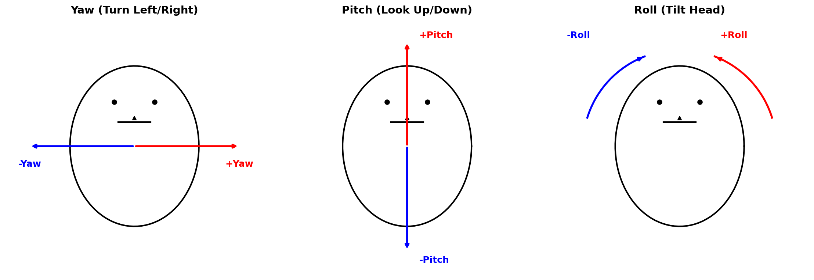

# Face ID Attr — 模块化人脸识别流水线

一个基于 Python 的模块化人脸识别系统，支持人脸检测、关键点校正、特征提取、1:1 比对、1:N 身份识别和人脸属性分析。所有模块均可通过 YAML 配置文件灵活切换，无需修改代码。

## Recent Updates

- **2026.03.26** — 新增 MediaPipe 478 点关键点校正（MediaPipeAligner），align 命令支持绘制完整关键点
- **2026.03.26** — 新增头部姿态估计（PFLD 98 点 + solvePnP），`headpose` 命令输出 Yaw/Pitch/Roll + 3D 坐标轴
- **2026.03.26** — 新增表情识别 / 微笑检测（ExpressionAnalyzer），支持 7 类表情和 smile_mode 切换
- **2026.03.26** — 新增 ArcFace 人脸识别模块（512 维），支持 glint360k_r50 和 webface_r50
- **2026.03.26** — 打包为可安装 Python 包，支持 `pip install -e .` 和 `from face_id_attr import ...`
- **2026.03.25** — 新增 SER-FIQ 质量评估（基于 ArcFace 特征稳定性），替换达摩院 FQA
- **2026.03.25** — 新增 `video` 命令，视频人脸识别（IoU/SORT/ByteTrack 跟踪）+ 实时表情标注
- **2026.03.25** — 新增 `evaluate` 命令，Rank-1/Precision/Recall/F1/AUC/EER 评测
- **2026.03.24** — 集成 PFLD_GhostOne 98 点关键点模型用于人脸校正
- **2026.03.24** — 移除 DeepFace 依赖，全部改用轻量级 ONNX / OpenCV 方案

## 特性

- **模块化架构**：检测、校正、识别、数据库、属性分析五大模块，各自独立，通过抽象基类约束接口
- **配置驱动**：通过 `config.yaml` 动态加载模块，切换算法只需改配置
- **多种检测器**：YOLO（v8/v11/v12/v26）、YuNet（OpenCV 轻量级）、OpenCV DNN/Haar
- **多种关键点校正**：PFLD 98 点、MediaPipe 478 点、SimpleAligner 5 点，可配置切换
- **多种识别器**：ArcFace 512 维（glint360k/webface）、SFace 128 维（OpenCV）
- **SER-FIQ 质量评估**：基于识别模型特征稳定性，不需要额外质量模型
- **向量数据库**：内置 NumPy 余弦相似度检索，注册自动去重，可扩展为 FAISS/Milvus
- **完整 CLI**：注册、识别、比对、检测、关键点对齐、特征可视化，支持单张和批量操作
- **注册去重**：基于特征余弦相似度自动跳过已注册的重复人脸，阈值可配置
- **特征可视化**：支持 t-SNE / PCA / UMAP 降维可视化已注册人脸特征分布，输出类内相似度统计
- **表情识别 / 微笑检测**：基于 YOLO 分类模型，支持 7 类表情和微笑二分类，可配置切换
- **头部姿态估计**：基于 PFLD 98 点关键点 + solvePnP，输出 Yaw/Pitch/Roll 角度和 3D 坐标轴可视化
- **视频人脸识别**：检测 + 跟踪（IoU/SORT/ByteTrack）+ 定期识别 + 实时表情标注

## 项目结构

```
face_id_attr/
├── __init__.py              # 包入口
├── __main__.py              # python -m face_id_attr 支持
├── pyproject.toml           # 打包配置
├── main.py                  # CLI 入口
├── factory.py               # 根据 config.yaml 动态构建 pipeline
├── pipeline.py              # FaceRecogPipeline 流水线核心
├── config.yaml              # 模块配置文件
├── requirements.txt         # Python 依赖
├── module/
│   ├── face_detection/      # 人脸检测模块
│   │   ├── yolo_detector.py #   YOLO 检测器 (.pt/.onnx)
│   │   ├── yunet_detector.py#   YuNet 检测器 (OpenCV)
│   │   └── opencv_detector.py#  OpenCV DNN / Haar 检测器
│   ├── face_alignment/      # 人脸校正模块
│   │   ├── pfld_aligner.py  #   PFLD_GhostOne 98 点关键点
│   │   ├── mediapipe_aligner.py # MediaPipe 478 点关键点
│   │   └── simple_aligner.py#   简单 5 点仿射变换
│   ├── face_recognition/    # 人脸识别模块
│   │   ├── arcface_recognizer.py # ArcFace 512 维 (glint360k/webface)
│   │   ├── sface_recognizer.py   # SFace 128 维 (OpenCV)
│   │   └── histogram_recognizer.py # 直方图特征 (演示用)
│   ├── face_database/       # 人脸向量数据库
│   │   └── numpy_db.py      #   NumPy 余弦相似度检索 + 去重
│   ├── face_quality/        # 人脸质量评估模块
│   │   ├── serfiq_assessor.py #  SER-FIQ (基于识别模型特征稳定性)
│   │   └── fqa_assessor.py  #   达摩院 FQA 模型
│   ├── face_analysis/       # 人脸属性分析模块
│   │   ├── expression_analyzer.py # 表情识别 / 微笑检测
│   │   └── head_pose_estimator.py # 头部姿态估计
│   └── face_tracking/       # 人脸跟踪模块 (视频)
│       ├── iou_tracker.py   #   IoU 贪心匹配
│       ├── sort_tracker.py  #   SORT (Kalman + 匈牙利)
│       └── byte_tracker.py  #   ByteTrack (两阶段关联)
├── models/                  # 模型文件 (不纳入 git)
├── docs/                    # 文档资源
└── results/                 # 输出结果
```

## 安装

```bash
# 基础安装
pip install -e .

# 带 YOLO 检测器
pip install -e ".[yolo]"

# 带 MediaPipe 关键点
pip install -e ".[mediapipe]"

# 全部依赖
pip install -e ".[all]"

# 从 GitHub 安装
pip install git+https://github.com/zhouchanggeng/face_id_attr.git
```

核心依赖：`opencv-python`, `numpy`, `pyyaml`, `onnxruntime`

可选依赖：`ultralytics`(YOLO), `mediapipe`(478点关键点), `scikit-learn`+`matplotlib`(可视化)

## 模型准备

模型文件较大，不包含在仓库中，需自行下载放置到 `models/` 目录：

| 模型 | 用途 | 格式 | 路径 |
|------|------|------|------|
| YOLO WiderFace | 人脸检测 | PyTorch | `models/yolo26m_wider_face/weights/best.pt` |
| YOLO WiderFace | 人脸检测 | ONNX | `models/yolo26m_wider_face/weights/yolo26m_facedetect_widerface.onnx` |
| YuNet | 人脸检测 (轻量) | ONNX | `models/yunet/face_detection_yunet_2023mar.onnx` |
| SFace | 人脸识别 (128维) | ONNX | `models/sface/face_recognition_sface_2021dec.onnx` |
| ArcFace Glint360K | 人脸识别 (512维) | ONNX | `models/arcface/glint360k_r50.onnx` |
| ArcFace WebFace | 人脸识别 (512维) | ONNX | `models/arcface/webface_r50.onnx` |
| PFLD_GhostOne | 98点关键点 | ONNX | `models/PFLD_GhostOne_112_1_opt_sim.onnx` |
| FQA | 人脸质量评估 | ONNX | `models/fqa_model.onnx` |
| FaceLandmarker | 478点关键点 (MediaPipe) | .task | `models/face_landmarker.task` |
| YOLO26s-cls | 表情识别 (RAF-DB 7类) | ONNX | `models/expression/yolo26s_cls_rafdb.onnx` |

> YOLO 检测器同时支持 `.pt` 和 `.onnx` 格式，ONNX 格式不依赖 PyTorch，适合部署场景。

## 使用方法

### 1. 注册已知人脸

将已知人脸图片按身份分类放入 `known_faces/` 目录：

```
known_faces/
├── alice/
│   ├── alice_001.jpg
│   └── alice_002.jpg
└── bob/
    ├── bob_001.jpg
    └── bob_002.jpg
```

批量注册：

```bash
python main.py register --dir known_faces
```

注册单张：

```bash
python main.py register --name alice --img face.jpg
```

### 2. 人脸识别 (1:N)

```bash
python main.py identify --img query.jpg --save
python main.py identify --dir images/ --save
python main.py identify --img query.jpg --threshold 0.6 --top-k 3
```

### 3. 人脸比对 (1:1)

```bash
python main.py compare --img1 a.jpg --img2 b.jpg
```

### 4. 人脸检测

```bash
python main.py detect --img face.jpg --save
python main.py detect --dir images/ --save --output-dir results
```

### 5. 人脸关键点对齐

```bash
python main.py align --img face.jpg --save
python main.py align --dir images/ --save
```

输出：
- `results/xxx_result.jpg` — 原图标注 bbox + 完整关键点（98/478 小绿点）+ 5 关键点（大彩色圆）
- `results/aligned/xxx_result_face0.jpg` — 对齐后的 112x112 人脸

### 6. 人脸质量评估

基于 SER-FIQ（识别模型特征稳定性）或达摩院 FQA 模型，对对齐后的人脸打分（0~1）。

```bash
python main.py quality --img face.jpg --save
python main.py quality --dir images/ --save
```

### 7. 特征可视化

将已注册的人脸特征降维到 2D 可视化，分析身份聚类质量和类内相似度。

```bash
# t-SNE 可视化（默认）
python main.py visualize

# PCA 可视化
python main.py visualize --method pca --output feature_pca.png

# UMAP 可视化（需 pip install umap-learn）
python main.py visualize --method umap
```

输出散点图（不同身份不同颜色）和类内相似度统计（mean/min/max）。

### 8. 识别性能评测

对测试集进行 1:N 识别评测，输出多维度指标、每个身份的详细统计、ROC 曲线。

测试目录结构（子目录名 = ground truth 身份）：
```
test_faces/
├── alice/
│   ├── alice_001.jpg
│   └── alice_002.jpg
└── bob/
    └── bob_001.jpg
```

```bash
# 使用默认阈值评测
python main.py evaluate --dir test_faces

# 指定阈值和输出目录
python main.py evaluate --dir test_faces --threshold 0.5 --output-dir eval_results
```

输出：
- 终端打印：Rank-1 准确率、Precision、Recall、F1、每个身份的详细统计
- `evaluate_report.csv` — 每张图片的详细识别结果
- `evaluate_summary.txt` — 汇总指标
- `roc_curve.png` — ROC 曲线 + TAR/FAR/FRR vs Threshold 图

评测指标说明：

| 指标 | 含义 |
|------|------|
| Rank-1 准确率 | top-1 检索命中正确身份的比例（不考虑阈值） |
| Precision | 识别结果中正确的比例（阈值以上） |
| Recall | 库中身份被正确识别的比例 |
| F1-Score | Precision 和 Recall 的调和平均 |
| AUC | ROC 曲线下面积，越接近 1 越好 |
| EER | FAR = FRR 时的错误率，越低越好 |
| TAR@FAR=0.001 | FAR 为千分之一时的通过率 |

### 9. 人脸属性分析（表情识别 / 微笑检测）

```bash
python main.py analyze --img face.jpg --save
python main.py analyze --dir images/ --save
```

支持 7 类表情（RAF-DB）和微笑检测模式，通过 config.yaml 中 `smile_mode` 切换。

### 10. 视频人脸识别

```bash
python main.py video --input video.mp4
python main.py video --input video.mp4 --tracker byte --threshold 0.5
```

输出标注视频（身份 + 表情 + 跟踪 ID）和 `track_log.csv` 跟踪日志。

### 11. 数据库管理

```bash
# 列出已注册身份
python main.py list

# 删除身份
python main.py remove --name alice
```

## 配置说明

通过 `config.yaml` 配置各模块，格式为：

```yaml
detector:
  class: "module.face_detection.yolo_detector.YOLOFaceDetector"
  params:
    model_path: "models/yolo26m_wider_face/weights/yolo26m_facedetect_widerface.onnx"
    conf_threshold: 0.5

aligner:
  class: "module.face_alignment.pfld_aligner.PFLDAligner"  # 或 mediapipe_aligner.MediaPipeAligner
  params:
    model_path: "models/PFLD_GhostOne_112_1_opt_sim.onnx"

recognizer:
  class: "module.face_recognition.arcface_recognizer.ArcFaceRecognizer"
  params:
    model_path: "models/arcface/glint360k_r50.onnx"

database:
  class: "module.face_database.numpy_db.NumpyFaceDatabase"
  params:
    dup_threshold: 0.9
  db_path: "face_db.npz"

quality_assessor:
  class: "module.face_quality.serfiq_assessor.SERFIQAssessor"
  params:
    model_path: "models/arcface/glint360k_r50.onnx"

analyzer:
  class: "module.face_analysis.expression_analyzer.ExpressionAnalyzer"
  params:
    model_path: "models/expression/yolo26s_cls_rafdb.onnx"
    class_names: "rafdb_7"
    smile_mode: false

tracker:
  type: "sort"  # iou / sort / byte
  params:
    iou_threshold: 0.3
    recognize_interval_sec: 1.0
```

切换算法只需修改 `class` 和 `params`，无需改代码。

## 可选检测器/识别器组合

| 检测器 | 校正器 | 识别器 | 说明 |
|--------|--------|--------|------|
| YOLO (.onnx) | PFLDAligner (98点) | ArcFace (512维) | 默认配置，精度高 |
| YOLO (.onnx) | MediaPipeAligner (478点) | ArcFace (512维) | 关键点最精细 |
| YOLO (.pt) | PFLDAligner | ArcFace | 需要 PyTorch |
| YuNet | SFace alignCrop | SFace (128维) | 轻量级，纯 OpenCV |
| OpenCV Haar | SimpleAligner | Histogram | 零依赖演示 |

## 流水线架构

```
输入图像 / 视频帧
  │
  ▼
┌─────────────┐
│  人脸检测    │  YOLOFaceDetector / YuNetDetector / OpenCVDetector
└──────┬──────┘
       │ faces: [{bbox, confidence, landmarks}, ...]
       ▼
┌─────────────┐
│  人脸校正    │  PFLDAligner (98点) / MediaPipeAligner (478点) / SimpleAligner
└──────┬──────┘
       │ aligned_face: 112x112 BGR, landmarks_98
       ├──────────────────────────────────┐
       ▼                                  ▼
┌─────────────┐                  ┌──────────────────┐
│  质量评估    │  SER-FIQ         │  头部姿态估计      │  solvePnP → Yaw/Pitch/Roll
└──────┬──────┘                  └──────────────────┘
       ▼
┌─────────────┐
│  特征提取    │  ArcFaceRecognizer (512维) / SFaceRecognizer (128维)
└──────┬──────┘
       │
       ├──────────────────────────────────┐
       ▼                                  ▼
┌─────────────┐                  ┌──────────────────┐
│  向量检索    │  NumpyFaceDatabase │  表情识别 / 微笑   │  ExpressionAnalyzer (7类)
└──────┬──────┘                  └──────────────────┘
       │ identity, similarity
       ▼
┌─────────────┐
│  人脸跟踪    │  IoUTracker / SORTTracker / ByteTracker (视频模式)
└──────┬──────┘
       ▼
     输出结果
```

## 头部姿态估计

基于 PFLD 98 点关键点 + `cv2.solvePnP` 估算三个欧拉角：



| 角度 | 含义 | 正值方向 |
|------|------|----------|
| Yaw | 偏航角（左右转头） | 向右 |
| Pitch | 俯仰角（抬头低头） | 抬头 |
| Roll | 翻滚角（歪头） | 向右歪 |

从 98 点中选取 6 个稳定参考点，与标准 3D 人脸模型对应求解：

| 参考点 | WFLW 索引 |
|--------|-----------|
| 鼻尖 | 54 |
| 下巴 | 16 |
| 左眼外角 | 60 |
| 右眼外角 | 72 |
| 左嘴角 | 76 |
| 右嘴角 | 82 |

```bash
python main.py headpose --img face.jpg --save
python main.py headpose --dir test_faces --save
```

输出图片上绘制 3D 坐标轴（红=X, 绿=Y, 蓝=Z）和角度标签。

## 扩展开发

实现对应的抽象基类即可添加新算法：

- `FaceDetector`：实现 `detect(image) -> List[dict]`
- `FaceAligner`：实现 `align(image, face) -> np.ndarray`
- `FaceRecognizer`：实现 `extract(face_image) -> np.ndarray`
- `FaceDatabase`：实现 `register()`, `search()`, `list_identities()`, `remove()`, `save()`, `load()`
- `FaceAnalyzer`：实现 `analyze(image, faces) -> List[dict]`
- `FaceQualityAssessor`：实现 `assess(face_image) -> float`

## TODO

- [ ] 活体检测（Anti-Spoofing）— 防照片/视频/3D 面具攻击
- [ ] 视线估计（Gaze Estimation）— 眼球注视方向预测
- [x] 人脸追踪（Face Tracking）— IoU / SORT / ByteTrack 三种跟踪算法，视频模式
- [x] 人脸质量评估（Face Quality Assessment）— 达摩院 FQA 模型，0~1 质量打分 + CSV 报告
- [ ] 口罩检测与遮挡人脸识别 — 戴口罩/墨镜场景下的检测与识别
- [x] 人脸属性分析 — 表情识别（RAF-DB 7类）+ 微笑检测，基于 YOLO 分类模型
- [x] 头部姿态估计（Head Pose Estimation）— PFLD 98点 + solvePnP，Yaw/Pitch/Roll + 3D 坐标轴
- [ ] 人脸分割（Face Parsing）— 面部区域语义分割（皮肤/眉毛/眼睛/嘴唇等）
- [ ] 视频流实时推理 — RTSP / USB 摄像头实时人脸识别
- [ ] FAISS / Milvus 向量数据库 — 大规模人脸库高效检索
- [ ] REST API 服务 — FastAPI 封装，支持 HTTP 接口调用
- [ ] 模型量化与边缘部署 — INT8 量化、TensorRT 加速、ONNX Runtime 优化

## References

| 模块 | 方法/模型 | 来源 |
|------|-----------|------|
| 人脸检测 | YOLOv26m WiderFace | [Ultralytics YOLO](https://github.com/ultralytics/ultralytics) |
| 人脸检测 | YuNet | [OpenCV Zoo - YuNet](https://github.com/opencv/opencv_zoo/tree/main/models/face_detection_yunet) |
| 关键点校正 | PFLD_GhostOne (98点) | [PFLD_GhostOne](https://github.com/AnthonyF333/PFLD_GhostOne) |
| 关键点校正 | MediaPipe FaceLandmarker (478点) | [MediaPipe](https://ai.google.dev/edge/mediapipe/solutions/vision/face_landmarker) |
| 人脸识别 | SFace | [OpenCV Zoo - SFace](https://github.com/opencv/opencv_zoo/tree/main/models/face_recognition_sface) |
| 人脸识别 | ArcFace (Glint360K/WebFace) | [InsightFace](https://github.com/deepinsight/insightface) |
| 质量评估 | SER-FIQ | [FaceImageQuality](https://github.com/pterhoer/FaceImageQuality) |
| 人脸质量评估 | FQA | [ModelScope - FQA](https://www.modelscope.cn/models/iic/cv_manual_face-quality-assessment_fqa) |
| 表情识别 | YOLO26s-cls (RAF-DB) | [Ultralytics](https://github.com/ultralytics/ultralytics) |
| 人脸跟踪 | SORT | [sort](https://github.com/abewley/sort) |
| 人脸跟踪 | ByteTrack | [ByteTrack](https://github.com/ifzhang/ByteTrack) |
| 人脸检测数据集 | WiderFace | [WiderFace](http://shuoyang1213.me/WIDERFACE/) |
| 关键点数据集 | WFLW (98点) | [WFLW](https://wywu.github.io/projects/LAB/WFLW.html) |

## Related Projects

- [InsightFace](https://github.com/deepinsight/insightface) — 开源 2D/3D 人脸分析工具箱，涵盖检测、识别、对齐、属性分析，提供 ArcFace / RetinaFace 等经典模型
- [libfacedetection](https://github.com/ShiqiYu/libfacedetection) — 于仕琪教授开源的轻量级 CNN 人脸检测库，支持 5 点关键点，适合嵌入式部署
- [MNN_FaceTrack](https://github.com/qaz734913414/MNN_FaceTrack) — 基于阿里 MNN 推理框架的实时人脸追踪方案，集成检测 + 关键点 + 追踪
- [SeetaFace6Open](https://github.com/SeetaFace6Open/index) — 中科视拓开源人脸识别引擎，包含人脸检测、关键点定位、识别、活体检测等完整模块
- [SeetaFaceTutorial](https://github.com/seetafaceengine/SeetaFaceTutorial) — 中科视拓开源人脸识别引擎说明文档
- [FaceMind](https://github.com/Justin-ljw/FaceMind) - 基于OpenCV + RetinaFace + ArcFace的深度学习实时人脸识别系统
- [arcface-pytorch](https://github.com/bubbliiiing/arcface-pytorch) - Arcface：人脸识别模型在Pytorch当中的实现

## License

MIT
